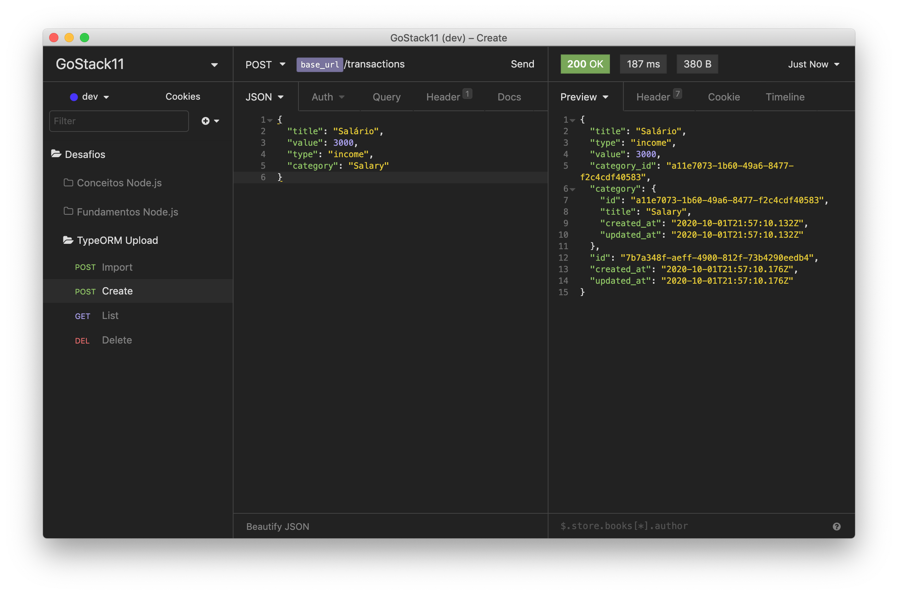
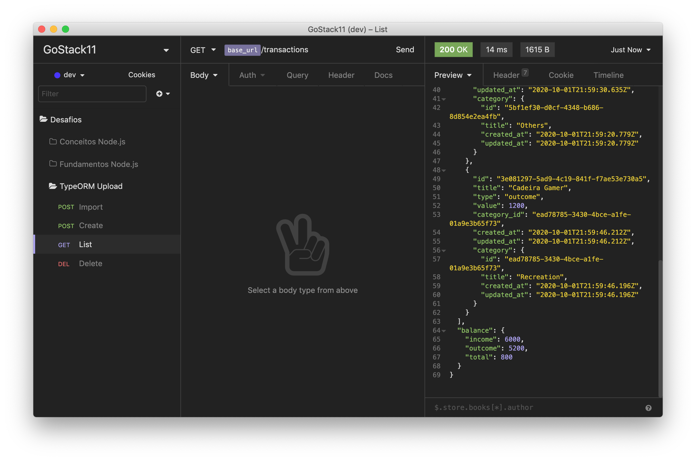
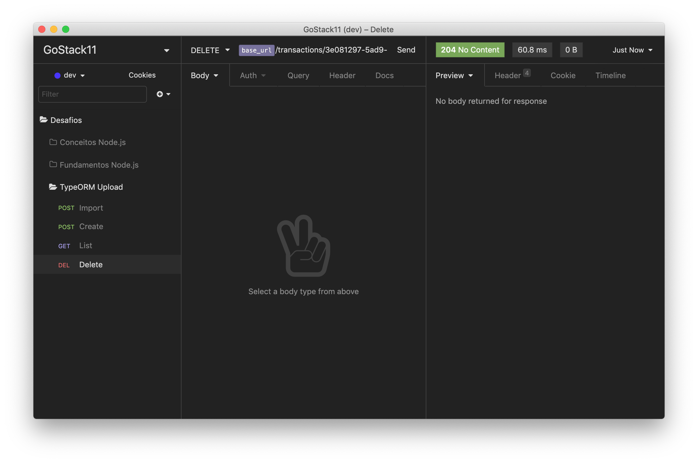
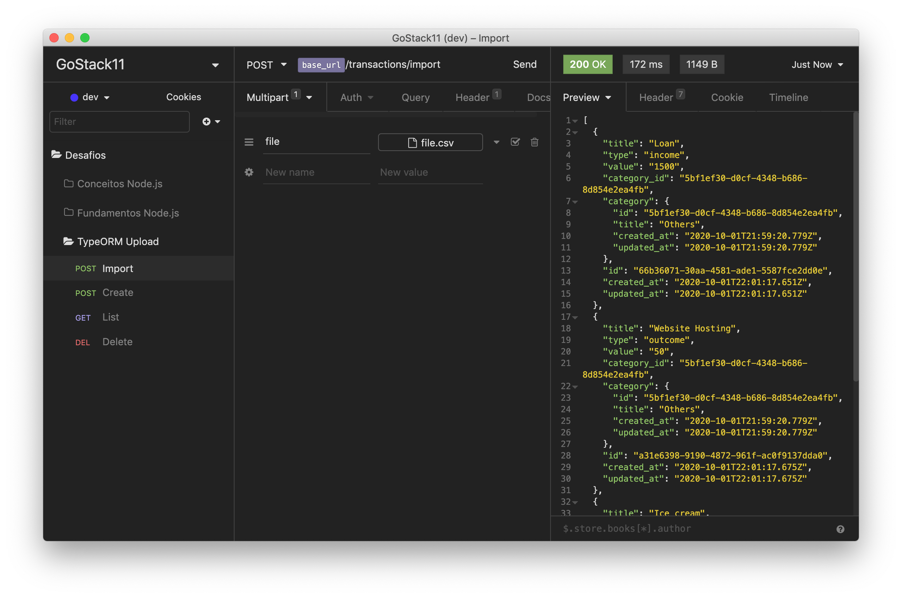

<div align="center">
  
</div>

<h3 align="center">
  Desafio 06: Banco de dados e upload de arquivos no Node.js
</h3>

<p align="center">
  <a href="#rocket-sobre-o-desafio">Sobre o desafio</a>&nbsp;&nbsp;&nbsp;|&nbsp;&nbsp;&nbsp;
  <a href="#hammer_and_wrench-tecnologias">Tecnologias</a>&nbsp;&nbsp;&nbsp;|&nbsp;&nbsp;&nbsp;
  <a href="#memo-licença">Licença</a>
</p>

## :rocket: Sobre o desafio

Aplicação criada para o [Desafio 06](https://github.com/rocketseat-education/bootcamp-gostack-desafios/tree/master/desafio-database-upload) do Bootcamp GoStack 11 da Rocketseat.

Ela é a continuação do [Desafio 05](https://github.com/andrenbrandao/bootcamp-gostack11-desafio-fundamentos-node), mas agora incluindo o uso de banco de dados com TypeORM e envio de arquivos com Multer.
Deve armazenar transações financeiras de entrada e saída e permitir o cadastro e a listagem dessas transações, além de permitir a criação de novos registros no banco de dados a partir do envio de um arquivo csv.

### Rotas da aplicação

- **`POST /transactions`**: A rota deve receber `title`, `value`, `type`, e `category` dentro do corpo da requisição, sendo o `type` o tipo da transação, que deve ser `income` para entradas (depósitos) e `outcome` para saídas (retiradas). Ao cadastrar uma nova transação, ela é armazenada dentro do banco de dados, possuindo os campos `id`, `title`, `value`, `type`, `category_id`, `created_at`, `updated_at`.

```json
{
  "id": "uuid",
  "title": "Salário",
  "value": 3000,
  "type": "income",
  "category": "Salary"
}
```

<div align="center">
  
</div>

- **`GET /transactions`**: Essa rota retorna uma listagem com todas as transações cadastradas até agora, junto com o valor da soma de entradas, retiradas e total de crédito. Essa rota retorna um objeto no seguinte formato:

```json
{
  "transactions": [
    {
      "id": "uuid",
      "title": "Salário",
      "value": 4000,
      "type": "income",
      "category": {
        "id": "uuid",
        "title": "Salary",
        "created_at": "2020-04-20T00:00:49.620Z",
        "updated_at": "2020-04-20T00:00:49.620Z"
      },
      "created_at": "2020-04-20T00:00:49.620Z",
      "updated_at": "2020-04-20T00:00:49.620Z"
    },
    {
      "id": "uuid",
      "title": "Freela",
      "value": 2000,
      "type": "income",
      "category": {
        "id": "uuid",
        "title": "Others",
        "created_at": "2020-04-20T00:00:49.620Z",
        "updated_at": "2020-04-20T00:00:49.620Z"
      },
      "created_at": "2020-04-20T00:00:49.620Z",
      "updated_at": "2020-04-20T00:00:49.620Z"
    },
    {
      "id": "uuid",
      "title": "Pagamento da fatura",
      "value": 4000,
      "type": "outcome",
      "category": {
        "id": "uuid",
        "title": "Others",
        "created_at": "2020-04-20T00:00:49.620Z",
        "updated_at": "2020-04-20T00:00:49.620Z"
      },
      "created_at": "2020-04-20T00:00:49.620Z",
      "updated_at": "2020-04-20T00:00:49.620Z"
    },
    {
      "id": "uuid",
      "title": "Cadeira Gamer",
      "value": 1200,
      "type": "outcome",
      "category": {
        "id": "uuid",
        "title": "Recreation",
        "created_at": "2020-04-20T00:00:49.620Z",
        "updated_at": "2020-04-20T00:00:49.620Z"
      },
      "created_at": "2020-04-20T00:00:49.620Z",
      "updated_at": "2020-04-20T00:00:49.620Z"
    }
  ],
  "balance": {
    "income": 6000,
    "outcome": 5200,
    "total": 800
  }
}
```

<div align="center">
  
</div>

- **`DELETE /transactions/:id`**: A rota deve deletar uma transação com o `id` presente nos parâmetros da rota;

<div align="center">
  
</div>

* **`POST /transactions/import`**: A rota permite a importação de um arquivo com formato `.csv` contendo as mesmas informações necessárias para criação de uma transação `id`, `title`, `value`, `type`, `category_id`, `created_at`, `updated_at`, onde cada linha do arquivo CSV deve ser um novo registro para o banco de dados, e por fim retorna todas as `transactions` que foram importadas para o banco de dados. O arquivo csv, segue o seguinte [modelo](.github/file.csv).

<div align="center">
  
</div>

## :hammer_and_wrench: Tecnologias

As seguintes ferramentas foram usadas na construção do projeto:

- [Node.js](https://nodejs.org/en/)
- [TypeScript](https://www.typescriptlang.org/)
- [TypeORM](https://typeorm.io/)
- [DBeaver](https://dbeaver.io/)
- [Docker](https://www.docker.com/)

## :memo: Licença

Esse projeto está sob a licença MIT. Veja o arquivo [LICENSE](LICENSE) para mais detalhes.
